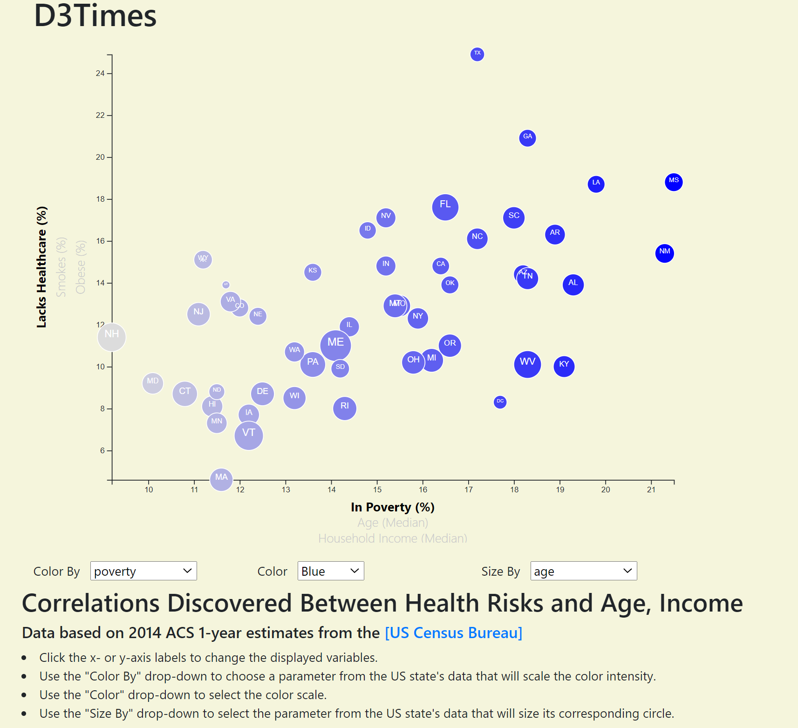

# D3-Challenge
Repo for HW 16
This assignment deals with US Census data. The data for each state is visualized as an SVG using javascript and d3. Parameters for the axes are selectable as are for the color, color scale, and size via user drop down. The plot animates with each change. The tooltips also update with the axis selection. The state abbreviations inside the circles change size with the circle.

app.js handles the data and the axes selections.
color.js handles the dropdowns.

